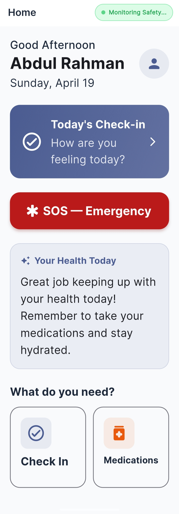
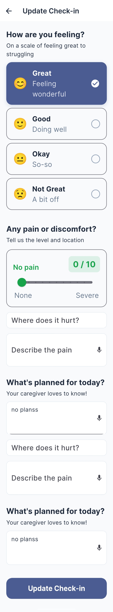
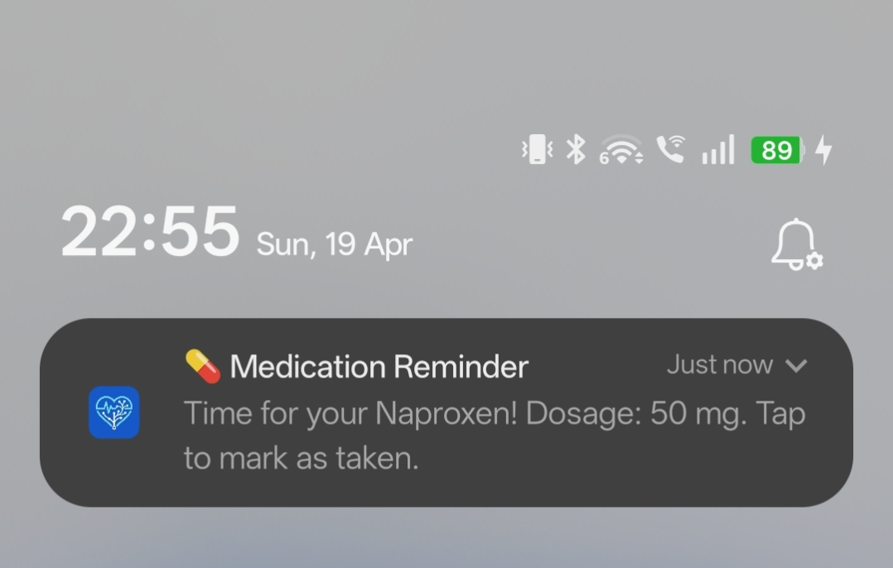
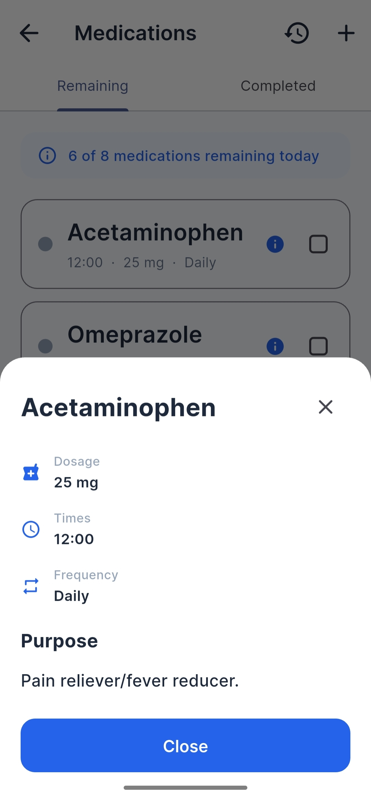
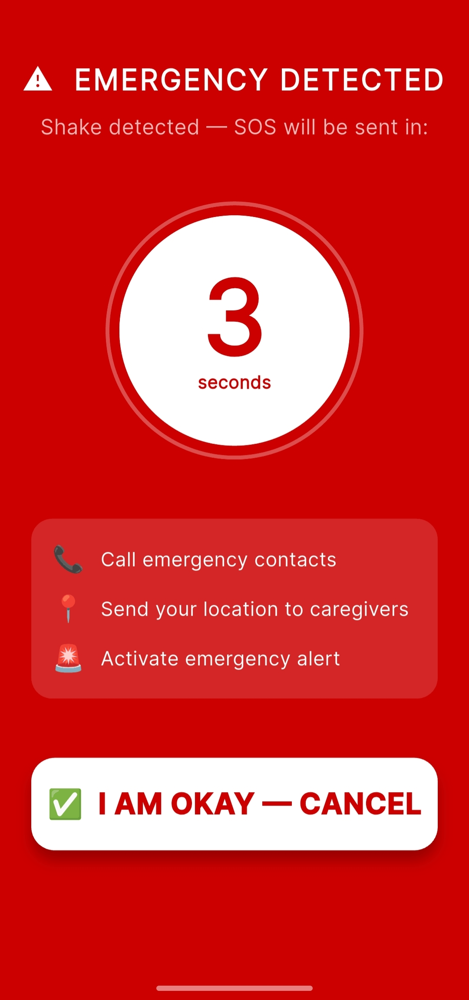
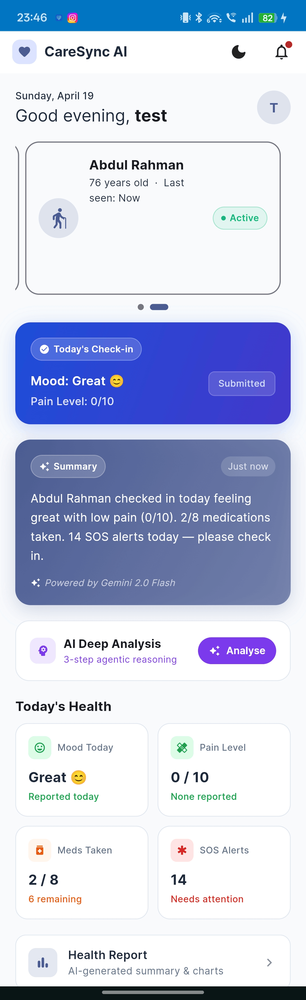
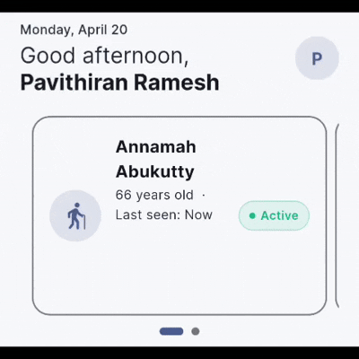
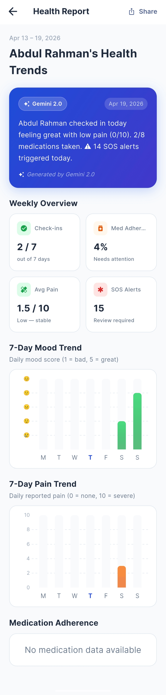
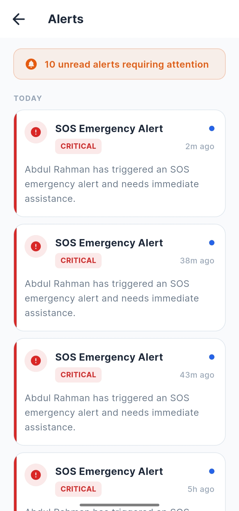

# 💖 CareSync AI

**AI-Powered Elderly Care Companion**

> Building peace of mind through real-time health monitoring, AI insights, and intelligent caregiving
>
> Built for the **Project 2030: MyAI Future Hackathon** - Track 3: Vital Signs (Healthcare & Wellbeing)
> Organised by: **GDG On Campus UTM**

---

## 📋 Project Overview

**CareSync AI** is a two-sided mobile and web application that connects elderly users with their family caregivers through real-time health monitoring, AI-generated insights, and intelligent emergency response. The app uses Gemini 2.0 Flash to analyze health patterns and provide actionable recommendations to caregivers.

### For the Elderly 👴👵
- ✅ **Role-Based Onboarding** - Separate flows for elderly and caregivers
- ✅ **Daily Health Check-ins** - Track mood, pain level, and general wellness
- 💊 **Smart Medication Tracking** - Reminder system with FDA drug information via openFDA API
- 🆘 **Emergency SOS Button** - One-tap crisis alerts with pulsing heartbeat animation
- 📅 **Calendar Adherence Tracking** - Visual medication history and completion calendar
- 👤 **Secure Re-login** - Access via Name + Date of Birth (alternative to password)
- ♿ **Accessibility Settings** - Large text (16px+), high contrast mode, colorblind-friendly palette

### For Caregivers 👨‍⚕️👩‍⚕️
- 📊 **Real-time Health Dashboard** - Multi-patient carousel view with live medication adherence
- 📈 **AI-Generated Health Summary** - Gemini analyzes patient data and creates weekly summaries
- 🔍 **3-Step AI Deep Analysis:**
  - **Signal Extractor** - Identifies health patterns and anomalies
  - **Risk Assessor** - Evaluates health risk levels
  - **Care Planner** - Recommends personalized interventions
- 🚨 **Intelligent Alerts** - Severity-coded notifications (CRITICAL/WARNING/NORMAL/INFO)
- 📱 **Push Notifications** - Real-time alerts for SOS emergencies and critical health changes
- 📈 **Weekly Trend Reports** - AI-generated insights with fl_chart bar charts
- 👥 **Multi-Patient Management** - Manage multiple elderly relatives via carousel
- 🌙 **Dark Mode Support** - Accessible, eye-friendly interface

---

## 🎬 Screenshots & Demos
### Elderly App Interface

<table>
  <tr>
    <td align="center"><b>Home Screen</b><br/></td>
    <td align="center"><b>Daily Check-in</b><br/></td>
    <td align="center"><b>Medication Reminders</b><br/></td>
  </tr>
</table>

<table>
  <tr>
    <td align="center"><b>Med Info (FDA Data)</b><br/></td>
    <td align="center"><b>SOS Emergency</b><br/></td>
  </tr>
</table>

### Caregiver Dashboard

<table>
  <tr>
    <td align="center"><b>Dashboard Overview</b><br/></td>
    <td align="center"><b>Patient Carousel</b><br/></td>
  </tr>
</table>

<table>
  <tr>
    <td align="center"><b>Health Reports</b><br/></td>
    <td align="center"><b>Alerts Feed</b><br/></td>
  </tr>
</table>


---

## 🚀 Key Features

| Feature | Description |
|---------|-------------|
| **Real-time Sync** | Firestore ensures caregivers see updates instantly |
| **AI-Generated Insights** | Gemini 2.0 analyzes patterns and generates health summaries |
| **FDA Drug Integration** | Automatic medication info from openFDA API |
| **Multi-device** | Flutter runs on Android, iOS, and Web |
| **Accessible UI** | Large fonts (16px+), high contrast, easy navigation for elderly |
| **Pull-to-Refresh** | Modern UI with instant data refresh |
| **Calendar Tracking** | Visual medication adherence calendar |
| **Role-Based Auth** | Elderly and Caregiver have separate login flows |

---

## 📋 Tech Stack

| Layer | Technology | Purpose |
|-------|-----------|---------|
| **Frontend** | Flutter 3.29 + Dart 3.7 | Cross-platform mobile & web UI (Android, iOS, Web) |
| **Database** | Cloud Firestore | Real-time data sync for health metrics, medications, alerts |
| **Authentication** | Firebase Auth | Secure user login & session management |
| **AI Core** | Google Gemini 2.0 Flash | Health analysis, summaries, chat companion, deep analysis |
| **AI Workflows** | Firebase Genkit | Agentic AI pipelines for health analysis (planned) |
| **Deployment** | Google Cloud Run | [Live Backend](https://caresync-ai-631057330468.europe-west1.run.app/) - Backend service deployment |
| **Push Notifications** | Firebase Cloud Messaging | SOS alerts, emergency notifications |
| **Local Notifications** | flutter_local_notifications | Local reminder alerts |
| **Charts & Analytics** | fl_chart | Weekly health trend visualization |
| **APIs** | openFDA REST API | Drug information, side effects, indications |
| **Navigation** | go_router | Type-safe declarative routing + role-based redirects |
| **State Management** | Provider | Reactive state management |
| **PDF Generation** | pdf | Generate health reports as PDF |
| **Localization** | intl | Date formatting, internationalization |
| **Local Storage** | shared_preferences | Persistent user preferences |
| **Fonts** | google_fonts | Inter typeface for UI consistency |
| **SVG Support** | flutter_svg | Vector graphics rendering |
| **Sharing** | share_plus | Native file sharing (Android, iOS) |
| **Input** | pinput | OTP/PIN input UI component |
| **Sensors** | sensors_plus | Accelerometer data (gesture detection) |

---

## 🛠️ How to Setup

### Prerequisites

Before you start, make sure you have:

- ✅ **Flutter 3.29+** - [Install Guide](https://docs.flutter.dev/get-started/install)
- ✅ **Dart 3.7+** (comes with Flutter)
- ✅ **Git** - For version control
- ✅ **Android Studio** or **VS Code** with Flutter extension
- ✅ **Android Emulator** or **Physical Device** (or use Chrome for web)
- ✅ **Firebase CLI** - `npm install -g firebase-tools` (optional, for Firebase setup)
- ✅ **Google Gemini API Key** - From [Google AI Studio](https://aistudio.google.com/app/apikey)

### Step 1: Clone the Repository

```bash
git clone https://github.com/pavithiranr/elderly-ai-care-app.git
cd elderly-ai-care-app
```

### Step 2: Install Dependencies

```bash
flutter pub get
```

### Step 3: Create .env File

Create a `.env` file in the project root with your Gemini API key:

```bash
# .env
GEMINI_API_KEY=your_actual_gemini_api_key_here
```

**Get your API key:**
1. Visit [Google AI Studio](https://aistudio.google.com/app/apikey)
2. Click "Create API Key"
3. Select your Google project or create a new one
4. Copy the API key and paste it in `.env`

### Step 4: Generate Firebase Configuration (REQUIRED)

⚠️ **Important:** The `lib/firebase_options.dart` file is NOT included in git for security reasons (contains API keys). You MUST generate it locally:

```bash
# Install Firebase CLI (if not already installed)
npm install -g firebase-tools

# Login to Firebase
firebase login

# Generate firebase_options.dart for the caresync-vertex project
flutterfire configure --project=caresync-vertex
```

This command will:
- ✅ Connect to the Firebase project `caresync-vertex`
- ✅ Detect your platform (Android, iOS, Web, Windows)
- ✅ Generate `lib/firebase_options.dart` with valid API keys
- ✅ This file is `.gitignore`'d and stays local on your machine

**Troubleshooting:**
- If you get "Project not found", you may need to create your own Firebase project via [Firebase Console](https://console.firebase.google.com)
- The file will be generated in `lib/firebase_options.dart` automatically

### Step 5: Install Platform-Specific Firebase Files (Optional)

```bash
# For Android, copy google-services.json to:
cp google-services.json android/app/
```

Verify the file exists at: `android/app/google-services.json`

### Step 6: Run the App

#### **On Android Emulator:**
```bash
# Start emulator
flutter emulators --launch <emulator-name>

# Run app
flutter run
```

#### **On Physical Device:**
```bash
# Enable USB Debugging on your device
flutter run -d <device-id>

# Find device ID:
flutter devices
```

#### **On Web (Chrome):**
```bash
flutter run -d chrome
```

#### **Run with Specific Device:**
```bash
# List available devices
flutter devices

# Run on specific device
flutter run -d <device-id>
```

### Step 7: Test Login Credentials

#### Elderly User
- **IC Number:** `558013857316` (Malaysia ID for testing)
- **Access Method:** ID-based login (no email/password required)

#### Caregiver User
- **Email:** `test@gmail.com`
- **Password:** `123456`

---

### Why IC-Based Login for Elderly Users?

We chose **IC (Identity Card) number as the primary authentication** for elderly users instead of email/password for these important reasons:

1. **Better Accessibility & Memory**
   - Elderly users may forget complex email addresses and passwords
   - IC number is a document they carry with them at all times
   - One less credential to remember = lower cognitive load

2. **Easier Account Recovery**
   - If they accidentally log out, they can simply enter their IC number again
   - No need for password recovery emails or security questions
   - Reduces frustration and support tickets

3. **Natural & Familiar**
   - IC is something elderly users interact with regularly (banking, healthcare, etc.)
   - Feels natural and less intimidating than password-based systems
   - Aligns with elderly-friendly UI principles (large text, simple steps)

4. **Security Without Complexity**
   - Still provides authentication (IC is unique per person)
   - Paired with Firebase Auth for backend security
   - Reduces password fatigue and weak password choices

This design prioritizes **usability over traditional security paradigms**, which is essential for elderly users. ♿

---

## 📦 Packages Used

| Package | Version | Purpose |
|---------|---------|---------|
| **flutter** | sdk | Flutter framework & widgets |
| **go_router** | 14.6.2 | Type-safe routing + role-based redirects |
| **provider** | 6.1.2 | Reactive state management |
| **firebase_core** | 3.12.0 | Firebase initialization |
| **firebase_auth** | 5.2.0 | User authentication |
| **cloud_firestore** | 5.6.0 | Real-time database |
| **firebase_messaging** | 15.2.5 | Push notifications (FCM) |
| **flutter_local_notifications** | 18.0.1 | Local reminder notifications |
| **google_fonts** | 6.2.1 | Inter font family |
| **fl_chart** | 0.70.0 | Bar charts for health trends |
| **http** | 1.2.2 | HTTP client for openFDA API |
| **flutter_dotenv** | 5.2.1 | Load .env file variables |
| **shared_preferences** | 2.3.3 | Local persistent storage |
| **pdf** | 3.11.0 | PDF generation for reports |
| **share_plus** | 12.0.2 | Native file sharing |
| **pinput** | 4.0.0 | OTP/PIN input widget |
| **flutter_svg** | 2.0.10+1 | SVG rendering |
| **intl** | 0.20.2 | Date formatting, localization |
| **timezone** | 0.9.4 | Timezone handling |
| **sensors_plus** | 7.0.0 | Accelerometer, gesture detection |
| **cupertino_icons** | 1.0.8 | iOS-style icons |

---

## 📂 Project Structure

```
elderly-ai-care-app/
│
├── lib/
│   ├── main.dart                      # App entry point + Firebase init
│   │
│   ├── core/
│   │   ├── constants/
│   │   │   ├── app_constants.dart     # Route names, roles, theme keys
│   │   │   └── app_theme.dart         # Colors, fonts, button styles
│   │   ├── theme/
│   │   │   └── theme_provider.dart    # Dark/light mode toggle
│   │   └── utils/
│   │       └── router.dart            # GoRouter config + redirects
│   │
│   ├── features/
│   │   ├── onboarding/
│   │   │   ├── onboarding_screen.dart      # Splash/landing page
│   │   │   └── role_selection_screen.dart  # Elderly vs Caregiver
│   │   │
│   │   ├── auth/
│   │   │   ├── elderly_setup_screen.dart   # Profile creation
│   │   │   └── caregiver_login_screen.dart # Caregiver auth
│   │   │
│   │   ├── elderly/
│   │   │   ├── home/
│   │   │   │   └── elderly_home_screen.dart
│   │   │   ├── checkin/
│   │   │   │   └── checkin_screen.dart     # Daily mood/pain check-in
│   │   │   ├── medication/
│   │   │   │   └── medication_screen.dart  # Reminder list + FDA info
│   │   │   ├── sos/
│   │   │   │   └── sos_screen.dart         # Emergency button
│   │   │   └── settings/
│   │   │       └── settings_screen.dart    # Profile & app settings
│   │   │
│   │   └── caregiver/
│   │       ├── dashboard/
│   │       │   └── caregiver_dashboard_screen.dart  # Main dashboard
│   │       ├── reports/
│   │       │   └── reports_screen.dart              # Weekly reports + charts
│   │       ├── alerts/
│   │       │   └── alerts_screen.dart               # Alert feed
│   │       └── elderly/
│   │           └── patient_detail_screen.dart       # Patient info
│   │
│   └── shared/
│       ├── models/
│       │   ├── user_model.dart
│       │   ├── patient_model.dart
│       │   └── medication_model.dart
│       └── services/
│           ├── patient_service.dart         # Firestore + FDA API
│           ├── caregiver_service.dart       # Caregiver data
│           ├── notification_service.dart    # Push notifications
│           ├── gemini_service.dart          # AI integration
│           └── user_session_service.dart    # Auth state
│
├── android/
│   ├── app/
│   │   ├── build.gradle.kts
│   │   └── src/main/AndroidManifest.xml
│   └── build.gradle.kts
│
├── ios/
│   ├── Runner.xcodeproj
│   └── Podfile
│
├── pubspec.yaml                 # Dependencies
├── pubspec.lock                 # Locked versions
├── analysis_options.yaml        # Dart linting
└── README.md                    # This file
```

---

## 🧪 Testing Medications

You can add these drugs for testing (they have FDA data):

### OTC Pain Relievers
- Aspirin
- Ibuprofen (Advil)
- Naproxen (Aleve)
- Acetaminophen (Tylenol)

### OTC Allergy/Cold
- Diphenhydramine (Benadryl)
- Cetirizine (Zyrtec)
- Loratadine (Claritin)

### Common Prescriptions
- Lisinopril
- Metformin
- Amoxicillin
- Propranolol

**How to test:**
1. Login as Elderly
2. Go to **Medications**
3. Tap **+ Add Medication**
4. Enter drug name (e.g., "Aspirin")
5. Tap the medication card
6. Tap **ℹ️ Info** → See FDA purpose

---

## 📊 Database Schema (Firestore)

### Elderly Profile
```
elderly/{userId}/
├── profile                 # Personal info
├── medications            # List of prescribed meds
│   └── {medId}/
│       ├── name, dosage, times, frequency
│       └── logs/          # Medication history
├── daily_checkins/        # Mood & pain scores
└── sos_alerts/           # Emergency events
```

### Caregiver Profile
```
caregivers/{caregiverId}/
├── profile                # Personal info
└── linkedElderlyIds[]     # Array of elderly IDs
```

---

## 🌟 Features In Action

### Medication Reminder Flow
1. **Elderly user** opens app → Sees medication list
2. **Swipes down** to refresh from Firestore (pull-to-refresh)
3. **Taps medication** → See details + FDA info
4. **Checks box** when taken → Logged to `medications/{medId}/logs`
5. **Caregiver** sees update in real-time on dashboard

### AI Health Analysis
1. **Elderly** completes daily check-in (mood + pain)
2. **Gemini API** analyzes data + generates summary
3. **Caregiver** receives alert if anomalies detected
4. **Weekly report** shows trends with charts

---

## 🤝 Contributing

### Branching Strategy

```
main                ← Stable, demo-ready code only - Never push directly
  └── dev           ← Active development - All PRs go here
      └── feature/* ← Individual feature branches
```

**Key Rules:**
- ✅ **DO** push daily work to `dev`
- ✅ **DO** create feature branches from `dev` for major features
- ❌ **NEVER** push directly to `main` (code review required)
- ✅ **DO** merge to `main` only for stable, tested releases

**Workflow:**
1. Create feature branch from `dev`: 
   ```bash
   git checkout dev
   git pull origin dev
   git checkout -b feature/your-feature
   ```
2. Make changes and commit:
   ```bash
   git commit -m "Add feature: describe what you added"
   ```
3. Push to your branch:
   ```bash
   git push origin feature/your-feature
   ```
4. Open PR to `dev` (NOT `main`)
5. After peer review and testing, merge to `dev`
6. When stable, open PR from `dev` → `main` for releases

---

## 📝 License

MIT License - See LICENSE file for details

---

## 🤖 AI Tools Used

This project leverages multiple AI tools to accelerate development and deliver intelligent features:

| Tool | Provider | Usage |
|------|----------|-------|
| **Gemini 2.0 Flash** | Google DeepMind | Core AI features within the app: health chat companion, weekly summaries, 3-step deep analysis |
| **Claude** | Anthropic | UI scaffolding, screen development, bug fixes, Git workflow setup, code reviews |
| **Claude Code** | Anthropic | Automated code fixes, feature implementation, refactoring |

---

## 👥 Team & Roles

| Role | Responsibility | Expertise |
|------|---------------|-----------|
| **Frontend Developer** | Flutter UI, screens, navigation, accessibility, responsive design | Mobile development, UI/UX |
| **Backend Developer** | Firebase setup, Firestore architecture, authentication, API integration | Cloud infrastructure, databases |
| **AI Developer** | Gemini integration, AI prompt engineering, Genkit workflows, health analysis logic | Machine learning, AI/ML |
| **QA & Testing** | Device testing, bug verification, accessibility compliance, performance | Quality assurance |

---

## 📝 Submission Information

| Detail | Value |
|--------|-------|
| **Hackathon** | Project 2030 - MyAI Future Hackathon |
| **Track** | Track 3 - Vital Signs (Healthcare & Wellbeing) |
| **Organization** | GDG On Campus UTM |
| **Repository** | [elderly-ai-care-app](https://github.com/pavithiranr/elderly-ai-care-app) |
| **License** | MIT |

---

## 🎯 Future Roadmap

- [ ] **Video Telehealth Consultations** - Real-time video calls between elderly and healthcare providers
- [ ] **Wearable Device Integration** - Apple Watch, Fitbit, Garmin smartwatch syncing
- [ ] **Offline Mode with Sync** - App functionality without internet, auto-sync when online
- [ ] **Multi-Language Support** - Localization for elderly-friendly interfaces
- [ ] **Advanced ML Predictions** - Predictive health risk assessments using Gemini's extended analysis
- [ ] **EHR Integration** - Connect with hospital/clinic electronic health records
- [ ] **Voice Commands** - Hands-free interaction for accessibility
- [ ] **Medication Photo Recognition** - AI identifies pills by image
- [ ] **Family Video Calls** - Direct messaging and video between elderly and caregivers
- [ ] **Therapist Integration** - Mental health support through licensed professionals

---

## 👨‍💻 Created By

Created by [@pavithiranr](https://github.com/pavithiranr) [@macpranesh](https://github.com/macpranesh) [@ghyrry](https://github.com/ghyrry)

---

**Made with ❤️ for Project 2030 - MyAI Future Hackathon**
