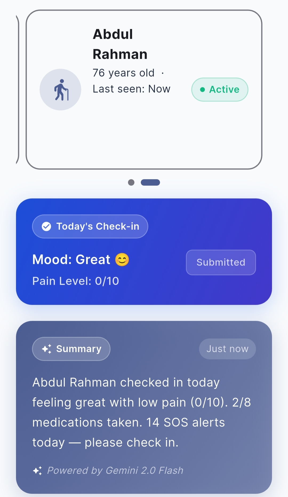

# 💖 CareSync AI

> **AI-powered elderly home care companion** — Built for the **Project 2030: MyAI Future Hackathon** (Track 3: Healthcare & Wellbeing)
>
> Connecting elderly users with family caregivers through real-time health monitoring, AI insights, and emergency response.

---

## 🎯 Overview

CareSync AI is a two-sided mobile and web application designed to provide **proactive health monitoring** and **peace of mind** for elderly users and their families.

### For the Elderly 👴👵
- ✅ **Daily Health Check-ins** — Mood, pain level, medication tracking
- 💊 **Smart Medication Reminders** — Pull-to-refresh medication status with FDA drug info
- 🆘 **Emergency SOS Button** — One-tap crisis alerts to caregivers
- 🤖 **AI Companion** — Chat with Gemini for health advice & support
- 📅 **Calendar Adherence Tracking** — Visual medication history

### For Caregivers 👨‍⚕️👩‍⚕️
- 📊 **Real-time Health Dashboard** — Multi-patient carousel view with live updates
- 🚨 **Intelligent Alerts** — AI-prioritized notifications with severity levels
- 📈 **Weekly Trend Reports** — AI-generated summaries with charts and insights
- 🔔 **Activity Timeline** — See what matters: medication taken, check-ins, SOS alerts
- 👥 **Multi-Patient Support** — Manage multiple elderly relatives easily

---

## 🎬 Screenshots & Demos
> **Note:** Place all screenshots and GIFs in the `ReadMD-pictures/` folder
### Elderly App Interface

<table>
  <tr>
    <td align="center"><b>Home Screen</b><br/></td>
    <td align="center"><b>Daily Check-in</b><br/></td>
    <td align="center"><b>Medication Reminders</b><br/></td>
  </tr>
</table>

<table>
  <tr>
    <td align="center"><b>Med Info (FDA Data)</b><br/></td>
    <td align="center"><b>SOS Emergency</b><br/></td>
    <td align="center"><b>AI Chat</b><br/></td>
  </tr>
</table>

### Caregiver Dashboard

<table>
  <tr>
    <td align="center"><b>Dashboard Overview</b><br/></td>
    <td align="center"><b>Patient Carousel</b><br/></td>
  </tr>
</table>

<table>
  <tr>
    <td align="center"><b>Health Reports</b><br/></td>
    <td align="center"><b>Alerts Feed</b><br/></td>
  </tr>
</table>

### 💓 Heartbeat Animation

> GIF of the heartbeat/pulse animation in action (medical theme)


---

## 🚀 Key Features

| Feature | Description |
|---------|-------------|
| **Real-time Sync** | Firestore ensures caregivers see updates instantly |
| **AI-Generated Insights** | Gemini 2.0 analyzes patterns and generates health summaries |
| **FDA Drug Integration** | Automatic medication info from openFDA API |
| **Multi-device** | Flutter runs on Android, iOS, and Web |
| **Accessible UI** | Large fonts (16px+), high contrast, easy navigation for elderly |
| **Pull-to-Refresh** | Modern UI with instant data refresh |
| **Calendar Tracking** | Visual medication adherence calendar |
| **Role-Based Auth** | Elderly and Caregiver have separate login flows |

---

## 📋 Tech Stack

| Layer | Technology | Purpose |
|-------|-----------|---------|
| **Frontend** | Flutter 3.29 | Cross-platform UI (Android, iOS, Web) |
| **Database** | Cloud Firestore | Real-time data sync for health metrics |
| **AI** | Gemini 2.0 API | Health analysis & alerts |
| **Charts** | fl_chart | Weekly trend visualization |
| **APIs** | openFDA REST | Drug information & side effects |
| **Auth** | Firebase Auth | Secure login |
| **Hosting** | Firebase Hosting | Web deployment |
| **Language** | Dart | Type-safe, fast compilation |

---

## 🛠️ How to Setup

### Prerequisites

Before you start, make sure you have:

- ✅ **Flutter 3.29+** — [Install Guide](https://docs.flutter.dev/get-started/install)
- ✅ **Dart 3.7+** (comes with Flutter)
- ✅ **Git** — For version control
- ✅ **Android Studio** or **VS Code** with Flutter extension
- ✅ **Android Emulator** or **Physical Device** (or use Chrome for web)

### Step 1: Clone the Repository

```bash
git clone https://github.com/pavithiranr/elderly-ai-care-app.git
cd elderly-ai-care-app
```

### Step 2: Install Dependencies

```bash
# Get all Flutter & Dart packages
flutter pub get
```

### Step 3: Setup Firebase (Optional)

If you want to use your own Firebase project:

```bash
# Configure Firebase for Flutter (requires Firebase CLI)
flutterfire configure
```

This will:
- Create Firebase project in your Google Cloud Console
- Generate `google-services.json` (Android)
- Generate `GoogleService-Info.plist` (iOS)
- Create `.firebaserc` configuration

### Step 4: Run the App

#### **On Android Emulator:**
```bash
# Start emulator
flutter emulators --launch <emulator-name>

# Run app
flutter run
```

#### **On Physical Device:**
```bash
# Enable USB Debugging on your device
# Connect device via USB
flutter run -d <device-id>

# Find device ID:
flutter devices
```

#### **On Web (Chrome):**
```bash
flutter run -d chrome
```

#### **Run with Specific Device:**
```bash
# List available devices
flutter devices

# Run on specific device
flutter run -d <device-id>
```

### Step 5: Test Login Credentials

| Role | Email | Password |
|------|-------|----------|
| Elderly | elderly@test.com | password123 |
| Caregiver | caregiver@test.com | password123 |

---

## 📂 Project Structure

```
elderly-ai-care-app/
│
├── lib/
│   ├── main.dart                      # App entry point + Firebase init
│   │
│   ├── core/
│   │   ├── constants/
│   │   │   ├── app_constants.dart     # Route names, roles, theme keys
│   │   │   └── app_theme.dart         # Colors, fonts, button styles
│   │   ├── theme/
│   │   │   └── theme_provider.dart    # Dark/light mode toggle
│   │   └── utils/
│   │       └── router.dart            # GoRouter config + redirects
│   │
│   ├── features/
│   │   ├── onboarding/
│   │   │   ├── onboarding_screen.dart      # Splash/landing page
│   │   │   └── role_selection_screen.dart  # Elderly vs Caregiver
│   │   │
│   │   ├── auth/
│   │   │   ├── elderly_setup_screen.dart   # Profile creation
│   │   │   └── caregiver_login_screen.dart # Caregiver auth
│   │   │
│   │   ├── elderly/
│   │   │   ├── home/
│   │   │   │   └── elderly_home_screen.dart
│   │   │   ├── checkin/
│   │   │   │   └── checkin_screen.dart     # Daily mood/pain check-in
│   │   │   ├── medication/
│   │   │   │   └── medication_screen.dart  # Reminder list + FDA info
│   │   │   ├── sos/
│   │   │   │   └── sos_screen.dart         # Emergency button
│   │   │   └── chat/
│   │   │       └── elderly_chat_screen.dart
│   │   │
│   │   └── caregiver/
│   │       ├── dashboard/
│   │       │   └── caregiver_dashboard_screen.dart  # Main dashboard
│   │       ├── reports/
│   │       │   └── reports_screen.dart              # Weekly reports + charts
│   │       ├── alerts/
│   │       │   └── alerts_screen.dart               # Alert feed
│   │       └── elderly/
│   │           └── patient_detail_screen.dart       # Patient info
│   │
│   └── shared/
│       ├── models/
│       │   ├── user_model.dart
│       │   ├── patient_model.dart
│       │   └── medication_model.dart
│       └── services/
│           ├── patient_service.dart         # Firestore + FDA API
│           ├── caregiver_service.dart       # Caregiver data
│           ├── notification_service.dart    # Push notifications
│           ├── gemini_service.dart          # AI integration
│           └── user_session_service.dart    # Auth state
│
├── android/
│   ├── app/
│   │   ├── build.gradle.kts
│   │   └── src/main/AndroidManifest.xml
│   └── build.gradle.kts
│
├── ios/
│   ├── Runner.xcodeproj
│   └── Podfile
│
├── pubspec.yaml                 # Dependencies
├── pubspec.lock                 # Locked versions
├── analysis_options.yaml        # Dart linting
└── README.md                    # This file
```

---

## 🧪 Testing Medications

You can add these drugs for testing (they have FDA data):

### OTC Pain Relievers
- Aspirin
- Ibuprofen (Advil)
- Naproxen (Aleve)
- Acetaminophen (Tylenol)

### OTC Allergy/Cold
- Diphenhydramine (Benadryl)
- Cetirizine (Zyrtec)
- Loratadine (Claritin)

### Common Prescriptions
- Lisinopril
- Metformin
- Amoxicillin
- Propranolol

**How to test:**
1. Login as Elderly
2. Go to **Medications**
3. Tap **+ Add Medication**
4. Enter drug name (e.g., "Aspirin")
5. Tap the medication card
6. Tap **ℹ️ Info** → See FDA purpose

---

## 📊 Database Schema (Firestore)

### Elderly Profile
```
elderly/{userId}/
├── profile                 # Personal info
├── medications            # List of prescribed meds
│   └── {medId}/
│       ├── name, dosage, times, frequency
│       └── logs/          # Medication history
├── daily_checkins/        # Mood & pain scores
└── sos_alerts/           # Emergency events
```

### Caregiver Profile
```
caregivers/{caregiverId}/
├── profile                # Personal info
└── linkedElderlyIds[]     # Array of elderly IDs
```

---

## 🌟 Features In Action

### Medication Reminder Flow
1. **Elderly user** opens app → Sees medication list
2. **Swipes down** to refresh from Firestore (pull-to-refresh)
3. **Taps medication** → See details + FDA info
4. **Checks box** when taken → Logged to `medications/{medId}/logs`
5. **Caregiver** sees update in real-time on dashboard

### AI Health Analysis
1. **Elderly** completes daily check-in (mood + pain)
2. **Gemini API** analyzes data + generates summary
3. **Caregiver** receives alert if anomalies detected
4. **Weekly report** shows trends with charts

---

## 🤝 Contributing

### Branching Strategy

```
main                ← Production-ready code only
  └── dev           ← Active development (all PRs go here)
      └── feature/* ← Individual feature branches
```

**Workflow:**
1. Create feature branch from `dev`: `git checkout -b feature/your-feature`
2. Make changes and commit: `git commit -m "Add feature: ..."`
3. Push to your branch: `git push origin feature/your-feature`
4. Open PR to `dev` (NOT `main`)
5. After review, merge to `dev`, then to `main` for releases

---

## 📝 License

MIT License — See LICENSE file for details

---

## 👥 Team

Built by a passionate team during the Project 2030 Hackathon.

- **Frontend/UI:** Flutter development & UI/UX
- **Backend:** Firebase Firestore & Cloud infrastructure  
- **AI:** Gemini 2.0 integration & health analysis
- **QA:** Testing & device compatibility

---

## 🎯 Future Roadmap

- [ ] Video call support for telehealth
- [ ] Wearable integration (Apple Watch, Fitbit)
- [ ] Offline mode with sync
- [ ] Multi-language support
- [ ] Advanced ML predictions for health risks
- [ ] Integration with EHR systems

---

**Made with ❤️ for Project 2030**
